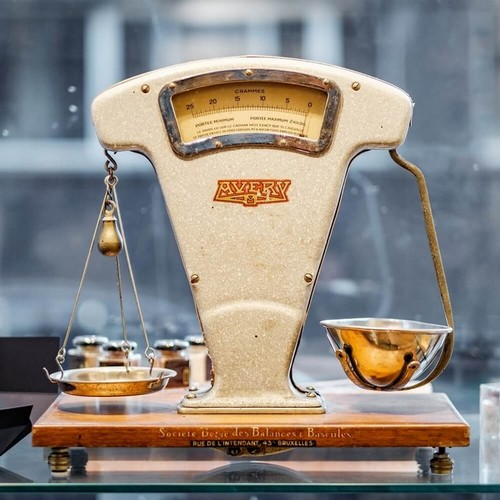

# Проект "Таблицы истинности и сравнения"

Выполнен в качестве практического задания 11.7 (Модуль 11. Старт в PHP) на курсе Профессия "Веб-разработчик" от SkillFactory.

Сделаны выводы о сравнении в PHP.

***

## Логические операторы

`$a && $b` — **И** — *true*, если и $a, и $b — *true*.

`$a || $b` — **ИЛИ** — *true*, если или $a, или $b — *true*.

`$a xor $b` — **исключающее ИЛИ** — *true*, если $a или $b — *true*, но не оба.

`! $a` — **отрицание** — *true*, если $a не *true*.

***

## Таблица сравнения типов

***

*Динамическая* **типизация** означает, что тип переменной определяется во время выполнения программы (а не во время компиляции).

**Типизация** говорит нам о том, что мы не можем совершать операции над объектами разного типа без приведения их к одному типу.

При **гибком '=='** (нестрогом) сравнении оператор осуществляет приведение между двумя различными типами, если они различаются (то есть он сравнивает значение ***после*** *преобразования типов*).

При **жёстком '==='** (строгом) сравнении оператор вернёт ***true***, только если оба операнда имеют одинаковый тип и одно и то же значение.

Используя в своём коде различные операторы сравнения, старайтесь пользоваться операторами со *строгим* сравнением, также учитывайте особенности *нестрогого* сравнения во избежание неожиданных ошибок и различия сравнения в PHP 7 и PHP 8.

***

`<?php var_dump("php" == 0);`

PHP 7.2: `bool(true)`

PHP 8.2: `bool(false)`

***

### Используемые технологии

* НTML
* CSS
* PHP

***

#### *Дата последнего редактирования: 31.01.2023 г.*
